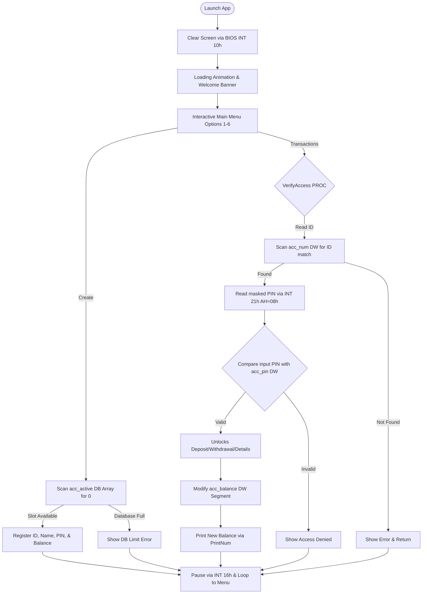

# Mini Banking Management System (8086 Assembly)

[-blue.svg)]()
[]()
[-purple.svg)]()
[]()

An interactive, high-fidelity 16-bit real-mode banking management system engineered entirely in 8086 Assembly Language for the EMU8086 emulator. This project implements classic database principles using low-level memory segment operations, dynamic addressing, hardware-level interrupts, and a robust ASCII terminal user interface.

Developed as a signature semester project for the Computer Organization and Assembly Language (COAL) curriculum.

---

## System Visual Experience

### Boot Screen & Loading Bar
```text
      ==========================================
      *      WELCOME TO MINI BANK SYSTEM       *
      ==========================================

      Initializing system components...
      [====================]

      System Ready! Press any key to continue...
```

### Interactive Operations Center
```text
  +--------------------------------------------+
  |         MINI BANK MANAGEMENT SYSTEM        |
  +--------------------------------------------+

  1. Create Account
  2. Deposit Money
  3. Withdraw Money
  4. Check Balance
  5. View Account Details
  6. Exit Program

  Enter your choice (1-6): 
```

---

## Features & Functionality

*   **Shielded PIN Verification**: Implements real-time input masking. Key entries are captured silently directly via the keyboard buffer, printing a clean sequence of '*' characters to prevent shoulder-surfing.
*   **Parallel Segment Database**: Simulates relational fields using synchronized parallel memory arrays for account states, unique codes, PIN credentials, balances, and reference addresses.
*   **Dynamic Account Provisioning**: Systematically scans memory limits for inactive accounts and sets up a new slot with instant buffer registers.
*   **BIOS-Powered GUI Frames**: Renders custom ASCII cards, double-border control lines, and clear layouts using standard 80x25 Color Text Mode 3.
*   **Responsive Clock Timing**: Integrates a hardware double-nested loop clock counter to control real-time responsive frames like the loading animation.

---

## Low-Level Architecture & Data Flow



---

## Core Computer Organization Concepts Demonstrated

### 1. BIOS & DOS Subsystems Interface
*   **`INT 10h` Video Standard**: Configures standard high-compatibility color text Mode 3 (`AH = 00h`, `AL = 03h`) to quickly clear the workspace and center elements.
*   **`INT 21h` System I/O**:
    *   `AH = 09h`: Scans memory boundaries and writes strings terminated by the standard dollar sign (`$`) delimiter.
    *   `AH = 01h`: Reads text with terminal echo for normal number inputs.
    *   `AH = 08h`: Reads directly from the keyboard input buffer without echoing characters to print custom asterisk masks instead.
*   **`INT 16h` BIOS Keyboard Controller**: Directly polls hardware keystrokes to pause screens without flooding output logs.

### 2. Pointer & Matrix Operations
*   **2D Strings indirect addressing**: To manage variable character sets without structure tags, string buffers are addressed through a custom word pointer array `acc_name_ptrs`. The target string buffer address is dynamically resolved inside registers (`MOV DI, acc_name_ptrs[DI]`) and written to directly via `[DI]` offsets.
*   **Word Index Calculations**: Automatically converts standard linear byte pointers (`SI`) to match word segment spaces (`DI`) using logical shifts (`SHL DI, 1`) before searching through database tables.

### 3. Stack Operations
*   **Execution Safety**: Procedures carefully utilize stack pushes (`PUSH`) and pops (`POP`) at entry and exit points to ensure global general-purpose registers remain pristine.
*   **Numeric Parsing**: The base-10 printer (`PrintNum`) recursively extracts binary remainders using division operations, pushes them onto the Stack, and pops them to reverse their visual output direction.

---

## How to Launch and Test

### Prerequisites
*   **EMU8086 Emulator**: Installed on your computer.

### Step-by-Step Run Guide
1.  Clone this repository to your local directory:
    ```bash
    git clone git@github.com:KhizarDoingProgramming/Banking-system-asm.git
    ```
2.  Open **EMU8086** and select `banking_system.asm`.
3.  Click the **Emulate** button (or press `F5`) to compile the 16-bit registers.
4.  Click the **Run** button to launch the interface.

### Recommended Test Cases
*   **Test Case 1 (Successful Check Balance)**:
    *   Choose option `4` (Check Balance).
    *   Enter Account ID: `1001`
    *   Enter Security PIN: `1234` (Masked input)
    *   *Result*: Displays holder `Mustafa` with balance `$5000`.
*   **Test Case 2 (Sufficient Withdrawal Verification)**:
    *   Choose option `3` (Withdraw Money).
    *   Authenticate with ID `1001` and PIN `1234`.
    *   Enter Withdrawal Amount: `2000`
    *   *Result*: Renders `[V] Withdrawal Successful!` and displays remaining balance of `$3000`.
*   **Test Case 3 (Registering a New Memory Slot)**:
    *   Choose option `1` (Create Account).
    *   Enter new details: ID `1003`, Name `Ayesha`, PIN `9012`, Deposit `7500`.
    *   *Verification*: Verify the account works by selecting option `5` (Details) and logging in with `1003` / `9012`.

---

## License
This project is licensed under the MIT License - see the [LICENSE](LICENSE) file for details.
